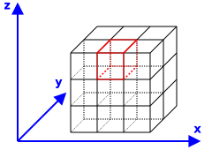
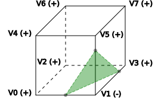

# Data visualization

_Official git repository: https://gitlab.com/Marc--Olivier/DataVisualization_

## What is this project about?

The `data visualization` project is a small project whose current goal is to display
4D data using isosurfaces. The project contains an implementation of the
[marching cubes algorithm](https://en.wikipedia.org/wiki/Marching_cubes)
to compute these isosurfaces.

The project is composed of the following modules:

* `third-parties` defines rules to download and compile some dependencies (
  [catch2](https://github.com/catchorg/Catch2), [googletest](https://github.com/google/googletest),
  [google/benchmark](https://github.com/google/benchmark)), and some small
  wrappers on top of them.
* `utils` contains cache friendly data structures for tiny containers.
* `marching-cubes` contains the classes that implement the marching cubes algorithm.
* `gui` defines a simple Graphical User Interface that can display isosurfaces for
   either the function _f(x,y,z)=x²+y²+z²_, or a DICOM file of your choice. To perform these tasks,
   the module depends on the libraries [Qt5](https://www.qt.io) and [DCMTK](http://git.dcmtk.org)
   that you must install separately.

Note that the `gui` module mainly contains code I wrote in 2010 using Qt4. Although I updated
some parts of the code, some other parts require more work, especially the class
[MCubesRenderer](gui/MCubesRenderer.hpp) that displays the triangles using OpenGL,
or [DicomReader](gui/DicomReader.hpp) that reads DICOM files. Actually, my plan
is rather to get rid of the `gui` module at some point (after having extracted
[DicomReader](gui/DicomReader.hpp) into a different module), and compile the code to
[WebAssembly](https://webassembly.org): would it not be convenient if you could visualise
your DICOM data in a web browser?

## Building the project

To build the whole project, you need to install the following components and libraries:

* [CMake](https://cmake.org/download/), version 3.8 or higher
* [Ninja](https://ninja-build.org), if you want a build system much faster than
  [Make](https://en.wikipedia.org/wiki/Make_\(software\))
* [DCMTK](http://git.dcmtk.org)
* [Qt5](https://www.qt.io), preferrably a recent version (I use Qt 5.11.1)

Then, execute the following commands:

```sh
git clone https://gitlab.com/Marc--Olivier/DataVisualization.git
cd DataVisualization
mkdir build
cd build
QT5_PATH=<path-to-your-installation-of-Qt5>
DCMTK_PATH=<path-to-your-installation-of-DCMTK>
# The following command will take some time:
# it downloads and compiles catch2, google-test and google/benchmark
cmake -G Ninja ../ -DCMAKE_BUILD_TYPE=Release -DCMAKE_PREFIX_PATH="$QT5_PATH;$DCMTK_PATH"
ninja
ninja test
# To run the application:
./gui/datavisualization
# Or ./gui/datavisualization.app/Contents/MacOS/datavisualization
# if you are using macos.
```

### Compiler support

So far, I only tested on macos with `clang 6.0.0` and
`Apple LLVM version 10.0.0 (clang-1000.11.45.2)`.

One of my next step is to compile the code with (at least) gcc.

## The marching cubes algorithm

### Description of the algorithm

The goal of the marching cubes algorithm is to approximate 
the isosurface for a value _v<sub>iso</sub>_ of a function _f(x,y,z)_.
This approximated isosurface is composed of triangles. 

The algorithm first breaks down the domain _(x, y, z)_
of the function _f(x,y,z)_ into cubes.

<p style="text-align:center;">
<br>
<b>Figure 1: Decomposing the domain into cubes</b>
</p>

Then, for each, the algorithm calculates a set of triangles that
approximate the isosurface within the cube. Each vertex of one of
these triangles is located on an edge of the cube. The number of
triangles require to approximate the isosurface, and the edges
where the vertices of these triangles are located, are determined
by the sign of _f(V<sub>i</sub>) - v<sub>iso</sub>_ at each cube
vertex _V<sub>i</sub>_. The set of signs _sign(V<sub>i</sub>) = (f(V<sub>i</sub>) - v<sub>iso</sub> ≥ 0)_
for a cube is called the cube configuration.

<p style="text-align:center;">
<br>
<b>Figure 2: Triangle approximation of the isosurface within a cube</b>
</p>

Figure 2 shows an example of one triangle approximating the isosurface within a cube
that has the configuration `+ - + + + + + +`.
Since _V<sub>1</sub>_ is the only 'negative' vertex of the cube, the vertices of this triangle
are on the edges connected to _V<sub>1</sub>_.
The exact positions of the intersection points depend on the value of _f_
at the vertices _V<sub>0</sub>_, _V<sub>1</sub>_, _V<sub>3</sub>_ and _V<sub>5</sub>_:
a linear interpolation is performed to calculate these exact positions.

The class [marchingcubes::MarchingCubes](marching-cubes/MarchingCubes.hpp) is the entry point
of the code that calculates the approximating triangles. 

### Cube configurations 

If _cubeconfig_ is a cube configuration, the cube configuration _flippedcubeconfiguration_
obtained by flipping each sign of _cubeconfig_ produces the same set of triangles
as _cubeconfig_. These are the only cube configurations that produce the same 
sets of triangles. Therefore, there are _2<sup>8</sup> / 2 = 128_ different set of triangles.
However, we don't need to implement the set of triangles for each of these _128_ configurations,
but we can calculate them from 15 base configurations described on
[Wikipedia](https://en.wikipedia.org/wiki/Marching_cubes) by applying well chosen symmetries
to these base configurations:

<p style="text-align:center;">
<br>
<b>Figure 3: The originally published 15 cube configurations
from <a href="https://en.wikipedia.org/wiki/File:MarchingCubes.svg">Wikipedia</a></b>
</p>

Actually, generating the set of triangles for each cube configuration is not very expensive,
but this should be rather done before the algorithm starts to loop over all the cubes.
[marchingcubes::MarchingCubes](marching-cubes/MarchingCubes.hpp) uses the class
[marchingcubes::ConfigsGenerator](marching-cubes/ConfigsGenerator.hpp) to
create a [marchingcubes::AllConfigs](marching-cubes/AllConfigs.hpp)
object that contains the set of triangles for each cube configuration. 

## Final thoughts

### Next steps

* Add CI jobs that compile the code and run the tests
  using different compilers.
* Add support for `gcc`.
* Compile the code to [WebAssembly](https://webassembly.org) (except the `gui` module).
  This especially requires to compile the library `DCMTK` to WebAssembly, library that
  depends on other libraries...

### Issues

#### Rendering svg images that are on GitLab

Issue https://gitlab.com/gitlab-org/gitlab-ce/issues/17276

I converted the svg images using Inkscape (see https://mijingo.com/blog/exporting-svg-from-the-command-line-with-inkscape.):

```sh
/Applications/Inkscape.app/Contents/Resources/bin/inkscape \
     -z `pwd`/doc/images/grid.svg -e `pwd`/doc/images/grid.png
/Applications/Inkscape.app/Contents/Resources/bin/inkscape \
     -z `pwd`/doc/images/cube_approximating_triangles.svg \
     -e `pwd`/doc/images/cube_approximating_triangles.png
```

### DICOM Datasets

* On [Medical Image Samples](http://www.barre.nom.fr/medical/samples), 
  you can open the ones from the [Multiple frames section](http://www.barre.nom.fr/medical/samples/#m-mr):
   * [MR-MONO2-8-16x-heart](http://www.barre.nom.fr/medical/samples/files/MR-MONO2-8-16x-heart.gz)
   * [US-MONO2-8-8x-execho](http://www.barre.nom.fr/medical/samples/files/US-MONO2-8-8x-execho.gz)
* DICOM images on [Visus](https://www.visus.com/fileadmin/content/pictures/Downloads/JiveX_DICOME_Viewer/democases.zip)
  that can't be loaded yet. I have to investigate the issue.
* Collections mentioned on [DCMTK website](https://support.dcmtk.org/redmine/projects/dcmtk/wiki/DICOM_images)

### Related softwares 

* [MicroDicom - free DICOM viewer for Windows](http://www.microdicom.com)
* [Visus](https://www.visus.com/en/downloads/jivex-dicom-viewer.html)
* From the article [5 Free DICOM Viewers for Any Practice](https://technologyadvice.com/blog/healthcare/5-dicom-viewers/):
  * [3DimViewer (for Windows and Mac OS X)](http://www.3dim-laboratory.cz/en/software/3dimviewer)
  * [DWV (DICOM Web Viewer)](https://github.com/ivmartel/dwv/wiki)
  * [Mango – short for Multi-image Analysis GUI](http://ric.uthscsa.edu/mango/)
  * [Escape EMV](https://escapetech.eu/dicom/index.html)
  * [IfranView](https://www.irfanview.com)
